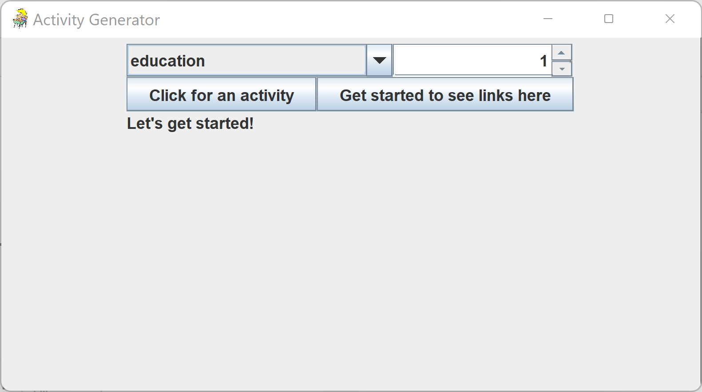
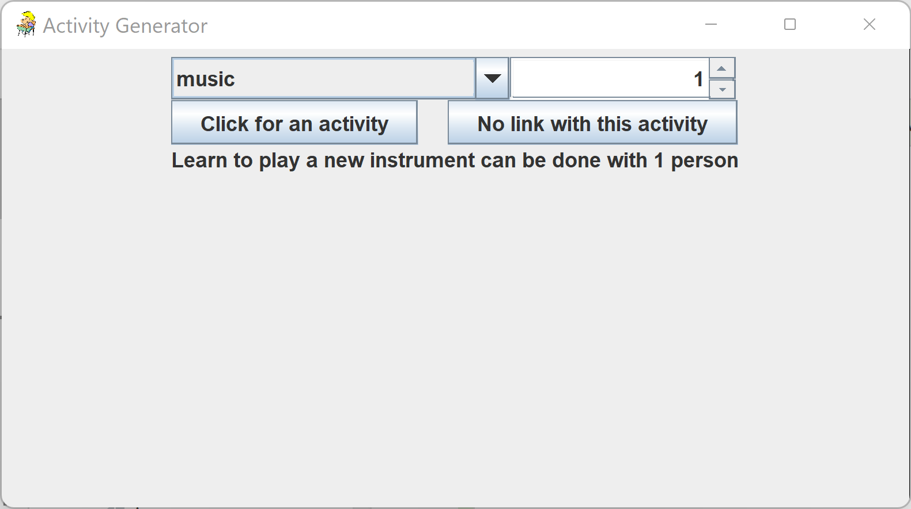

#Activity Generator
######Chaya Haor

This is a repository for my final project in for MCO152,
Computer Methodology at Touro in 2022

This project generates an activity to do based
on a given category and number of people. The activity is 
generated from a [Bored API](https://www.boredapi.com/documentation). 

This project uses:
- [Retrofit](https://square.github.io/retrofit/)
- [JUnit](https://junit.org/junit5/)
- [Mockito](https://site.mockito.org/)
- [Rx](https://reactivex.io/)
- [Gradle](https://gradle.org/)
- [Dagger](https://www.baeldung.com/dagger-2)

